# Linkraweb — Dokumentasi Sistem (Use Case, Flowchart & Program)

> **PT Lintas Wahana Teknologi** — Sistem Manajemen & Monitoring Proyek

---

## Daftar Isi

1. [Gambaran Umum Sistem](#1-gambaran-umum-sistem)
2. [Daftar Aktor](#2-daftar-aktor)
3. [Use Case Diagram](#3-use-case-diagram)
4. [Flowchart / Diagram Alir](#4-flowchart--diagram-alir)
5. [Spesifikasi Program](#5-spesifikasi-program)
6. [Arsitektur Sistem](#6-arsitektur-sistem)
7. [Database (ERD)](#7-database-erd)

---

## 1. Gambaran Umum Sistem

**Linkraweb** adalah aplikasi web internal untuk **manajemen dan monitoring proyek** di PT Lintas Wahana Teknologi. Sistem ini menyediakan:

- **Autentikasi** — Login via email & password (magic link), manajemen akun oleh admin
- **Manajemen Proyek** — Upload, edit, review, dan approve/reject proyek
- **Sistem Revisi** — Kirim laporan revisi lintas role dengan komentar dan persetujuan
- **Notifikasi** — Notifikasi in-app dan email secara real-time
- **Laporan & Analitik** — Grafik progres modul, eksport ke Excel/PDF

### Tech Stack

| Layer | Teknologi |
|---|---|
| Framework | Next.js 16 (Pages Router) |
| Bahasa | JavaScript (纯) |
| Database | MySQL 8.0 (3 database terpisah) |
| ORM | Prisma 6.19 |
| Autentikasi | JWT + HttpOnly Cookie |
| Email | Nodemailer (SMTP Gmail) |
| UI | Tailwind CSS v4, react-icons, framer-motion |
| Export | jsPDF, ExcelJS |

---

## 2. Daftar Aktor

| ID | Aktor | Deskripsi |
|---|---|---|
| A1 | **Admin** | Pengguna dengan role `admin`. Memiliki akses penuh ke semua fitur termasuk manajemen anggota |
| A2 | **Member** | Pengguna dengan role selain admin (`frontend`, `backend`, `uiux`, `qa`, `pm`). Akses terbatas (tidak bisa manajemen anggota) |
| A3 | **Guest** | Pengunjung yang belum login. Hanya bisa mengakses landing page |
| A4 | **Sistem (Email)** | Subsistem email (Nodemailer) yang mengirim notifikasi otomatis |

---

## 3. Use Case Diagram

### 3.1 Use Case — Guest (Belum Login)

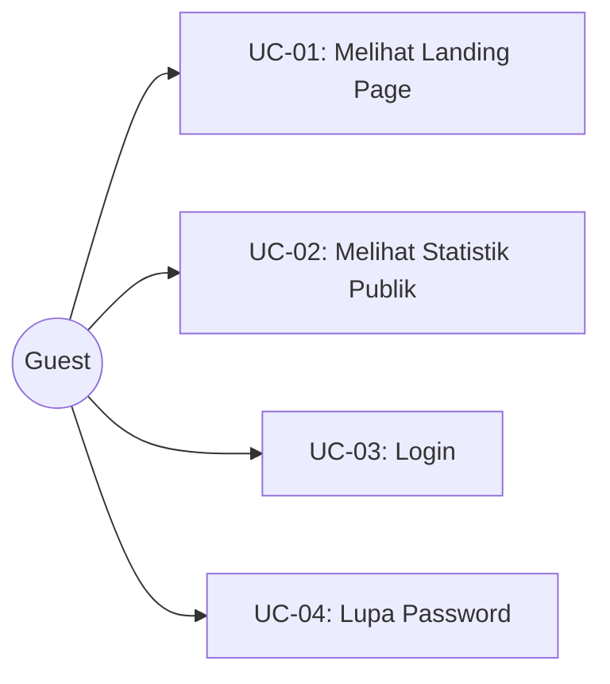

### 3.2 Use Case — Admin

```mermaid
graph TB
    Admin((Admin))

    subgraph Autentikasi
        UC05[UC-05: Logout]
        UC06[UC-06: Edit Profil]
        UC07[UC-07: Ganti Password]
        UC08[UC-08: Ganti Tema]
    end

    subgraph Manajemen Anggota
        UC09[UC-09: Lihat Daftar Anggota]
        UC10[UC-10: Tambah Anggota Baru]
        UC11[UC-11: Hapus Anggota]
        UC12[UC-12: Kirim Ulang Email Kredensial]
    end

    subgraph Manajemen Proyek
        UC13[UC-13: Buat/Upload Proyek]
        UC14[UC-14: Edit Proyek]
        UC15[UC-15: Hapus Proyek]
        UC16[UC-16: Review & Approve/Reject Proyek]
    end

    subgraph Sistem Revisi
        UC17[UC-17: Kirim Laporan Revisi]
        UC18[UC-18: Approve/Reject Revisi]
        UC19[UC-19: Komentar pada Revisi]
        UC20[UC-20: Hapus Revisi]
    end

    subgraph Notifikasi
        UC21[UC-21: Lihat Notifikasi]
        UC22[UC-22: Tandai Sudah Dibaca]
    end

    subgraph Laporan
        UC23[UC-23: Lihat Dashboard Statistik]
        UC24[UC-24: Lihat Grafik Analitik]
        UC25[UC-25: Export Laporan ke Excel/PDF]
    end

    Admin --> Autentikasi
    Admin --> Manajemen Anggota
    Admin --> Manajemen Proyek
    Admin --> Sistem Revisi
    Admin --> Notifikasi
    Admin --> Laporan
```

### 3.3 Use Case — Member

```mermaid
graph TB
    Member((Member))

    subgraph Autentikasi
        UC05b[UC-05: Logout]
        UC06b[UC-06: Edit Profil]
        UC07b[UC-07: Ganti Password]
        UC08b[UC-08: Ganti Tema]
    end

    subgraph Manajemen Proyek
        UC13b[UC-13: Buat/Upload Proyek]
        UC14b[UC-14: Edit Proyek]
        UC15b[UC-15: Hapus Proyek]
    end

    subgraph Sistem Revisi
        UC17b[UC-17: Kirim Laporan Revisi]
        UC18b[UC-18: Approve/Reject Revisi]
        UC19b[UC-19: Komentar pada Revisi]
    end

    subgraph Notifikasi
        UC21b[UC-21: Lihat Notifikasi]
        UC22b[UC-22: Tandai Sudah Dibaca]
    end

    subgraph Laporan
        UC23b[UC-23: Lihat Dashboard Statistik]
        UC24b[UC-24: Lihat Grafik Analitik]
    end

    Member --> Autentikasi
    Member --> Manajemen Proyek
    Member --> Sistem Revisi
    Member --> Notifikasi
    Member --> Laporan
```

### 3.4 Use Case — Detail Setiap Use Case

| ID | Use Case | Aktor | Deskripsi | Prekondisi | Postkondisi |
|---|---|---|---|---|---|
| UC-01 | Melihat Landing Page | Guest | Mengakses halaman utama (`/`) | Tidak ada | Halaman ditampilkan |
| UC-02 | Melihat Statistik Publik | Guest | Melihat jumlah proyek & anggota di landing page | Tidak ada | Data statistik ditampilkan |
| UC-03 | Login | Guest | Masuk ke sistem menggunakan email & password | Akun sudah terdaftar | JWT cookie dibuat, redirect ke dashboard |
| UC-04 | Lupa Password | Guest | Reset password via OTP email | Akun terdaftar | Password baru diatur |
| UC-05 | Logout | Admin, Member | Keluar dari sistem | Sudah login | JWT cookie dihapus |
| UC-06 | Edit Profil | Admin, Member | Mengubah nama, email, foto profil | Sudah login | Profil diperbarui |
| UC-07 | Ganti Password | Admin, Member | Mengubah password | Sudah login | Password diupdate |
| UC-08 | Ganti Tema | Admin, Member | Toggle dark/light mode | Sudah login | Tema berubah |
| UC-09 | Lihat Daftar Anggota | Admin | Melihat semua anggota beserta role & posisi | Role = admin | Daftar anggota ditampilkan |
| UC-10 | Tambah Anggota | Admin | Membuat akun anggota baru dengan role & posisi | Role = admin | Anggota dibuat, email kredensial terkirim |
| UC-11 | Hapus Anggota | Admin | Menghapus akun anggota dari sistem | Role = admin | Akun terhapus |
| UC-12 | Kirim Ulang Email | Admin | Mengirim ulang email kredensial ke anggota | Role = admin | Email terkirim ulang |
| UC-13 | Buat/Upload Proyek | Admin, Member | Membuat proyek baru dengan gambar & modul | Sudah login | Proyek tersimpan, notifikasi terkirim |
| UC-14 | Edit Proyek | Admin, Member | Mengubah data proyek | Pemilik proyek atau admin | Proyek diperbarui |
| UC-15 | Hapus Proyek | Admin, Member | Menghapus proyek beserta lampiran | Pemilik atau admin | Proyek & lampiran terhapus |
| UC-16 | Review Proyek | Admin | Approve atau reject proyek | Role = admin, project pending | Keputusan tersimpan, notifikasi terkirim |
| UC-17 | Kirim Revisi | Admin, Member | Mengirim laporan revisi ke role tertentu | Sudah login, target valid | Revisi tersimpan, notifikasi + email terkirim |
| UC-18 | Approve/Reject Revisi | Admin, Member | Menyetujui atau menolak laporan revisi | Sudah login, role target sesuai | Status revisi diupdate, notifikasi terkirim |
| UC-19 | Komentar Revisi | Admin, Member | Menambahkan komentar pada laporan revisi | Sudah login | Komentar tersimpan, notifikasi terkirim |
| UC-20 | Hapus Revisi | Admin, Member | Menghapus laporan revisi | Pemilik revisi | Revisi terhapus |
| UC-21 | Lihat Notifikasi | Admin, Member | Melihat daftar notifikasi | Sudah login | Daftar notifikasi ditampilkan |
| UC-22 | Tandai Dibaca | Admin, Member | Menandai notifikasi sudah dibaca | Sudah login | `isRead = true` |
| UC-23 | Dashboard Statistik | Admin, Member | Melihat ringkasan jumlah proyek, anggota, dll | Sudah login | Statistik ditampilkan |
| UC-24 | Grafik Analitik | Admin, Member | Melihat grafik kategori proyek & progres modul | Sudah login | Grafik ditampilkan |
| UC-25 | Export Laporan | Admin | Mengekspor laporan ke Excel atau PDF | Role = admin | File terdownload |

### 3.5 Use Case — Relasi Include & Extend

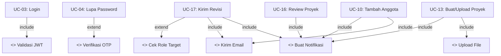

---

## 4. Flowchart / Diagram Alir

### 4.1 Flowchart — Login

```mermaid
flowchart TD
    Start([Mulai]) --> InputEmail[Input Email + Password]
    InputEmail --> ValidateInput{Input valid?}
    
    ValidateInput -->|Tidak| ErrInput[Error: Field wajib kosong]
    ErrInput --> EndFail([Gagal])
    
    ValidateInput -->|Ya| FindUser[Cari User di Database]
    FindUser --> UserExists{User ditemukan?}
    
    UserExists -->|Tidak| ErrUser[Error: User tidak ditemukan]
    ErrUser --> EndFail
    
    UserExists -->|Ya| CheckPass{Password cocok?}
    CheckPass -->|Tidak| ErrPass[Error: Password salah]
    ErrPass --> EndFail
    
    CheckPass -->|Ya| GenJWT[Generate JWT Token - 7 hari]
    GenJWT --> SetCookie[Set auth_token HttpOnly Cookie]
    SetCookie --> ReturnData[Return user data + redirect path]
    ReturnData --> CheckRole{Role?}
    
    CheckRole -->|admin| RedirectAdmin[/dashboardAdmin/admin]
    CheckRole -->|member| RedirectMember[/memberDashboard/MemberDashboard]
    
    RedirectAdmin --> EndOK([Berhasil])
    RedirectMember --> EndOK
    
    style Start fill:#22c55e,color:#fff
    style EndOK fill:#22c55e,color:#fff
    style EndFail fill:#ef4444,color:#fff
    style RedirectAdmin fill:#3b82f6,color:#fff
    style RedirectMember fill:#8b5cf6,color:#fff
```

### 4.2 Flowchart — Lupa Password (3 Langkah)

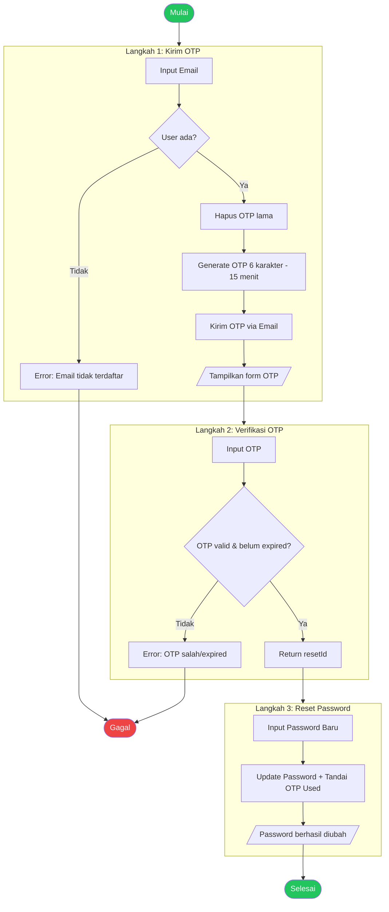

### 4.3 Flowchart — Tambah Anggota (Admin Only)

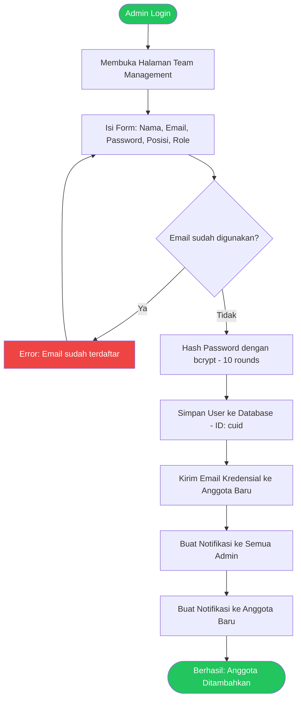

### 4.4 Flowchart — Upload Proyek

```mermaid
flowchart TD
    Start([User Login]) --> OpenProject[Membuka Project Management]
    OpenProject --> FillForm[Isi Form: Nama, Posisi, Repo Link, Tanggal, Tim]
    FillForm --> UploadImg{Upload Gambar?}
    
    UploadImg -->|Ya| ValImg{Valid? (jpg/png, max 10MB)}
    ValImg -->|Tidak| ErrImg[Error: Format/ukuran salah]
    ValImg -->|Ya| SaveImg[Simpan Gambar]
    UploadImg -->|Tidak| SkipImg
    
    SaveImg --> UploadMod{Upload Modul?}
    SkipImg --> UploadMod
    
    UploadMod -->|Ya| ValMod{Valid? (pdf/doc/docx, max 10MB)}
    ValMod -->|Tidak| ErrMod[Error: Format/ukuran salah]
    ValMod -->|Ya| SaveMod[Simpan Modul]
    UploadMod -->|Tidak| SkipMod
    
    SaveMod --> Upsert{Project sudah ada?}
    SkipMod --> Upsert
    
    Upsert -->|Ya| UpdateProject[Update Project yang ada]
    Upsert -->|Tidak| CreateProject[Buat Project Baru - ID: cuid]
    
    UpdateProject --> SaveAttach[Simpan Attachment Records - ID: autoincrement]
    CreateProject --> SaveAttach
    
    SaveAttach --> NotifyAll[Buat Notifikasi ke Semua User]
    NotifyAll --> EndOK([Berhasil: Proyek Diupload])
    
    ErrImg --> FillForm
    ErrMod --> FillForm
    
    style Start fill:#22c55e,color:#fff
    style EndOK fill:#22c55e,color:#fff
    style ErrImg fill:#ef4444,color:#fff
    style ErrMod fill:#ef4444,color:#fff
```

### 4.5 Flowchart — Review Proyek (Admin)

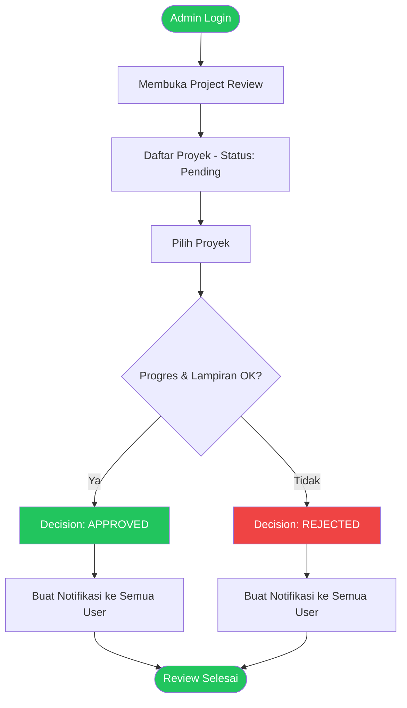

### 4.6 Flowchart — Kirim Laporan Revisi

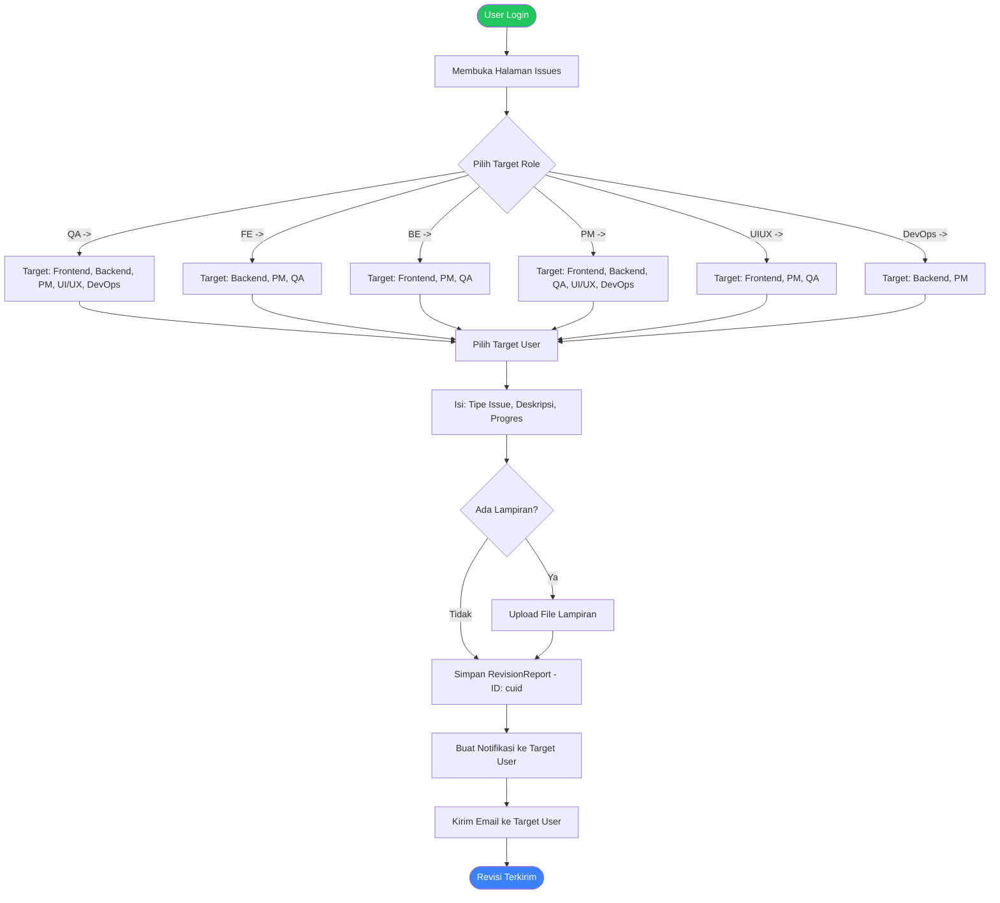

### 4.7 Flowchart — Proses Revisi (Target User)

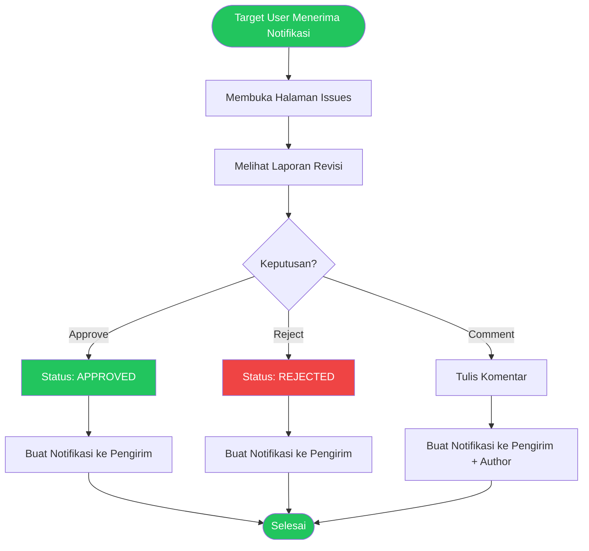

### 4.8 Flowchart — Sistem Notifikasi

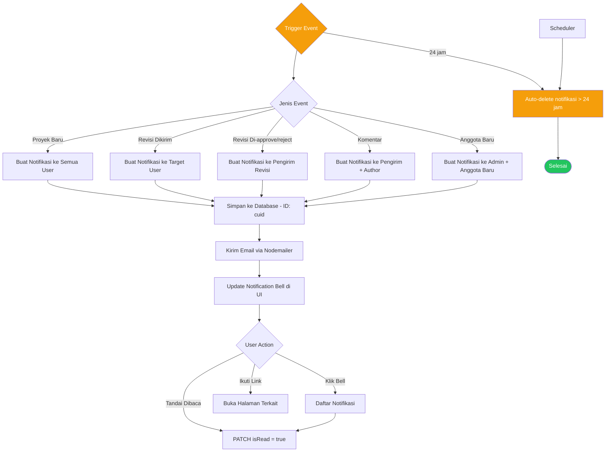

### 4.9 Flowchart — Export Laporan (Admin)

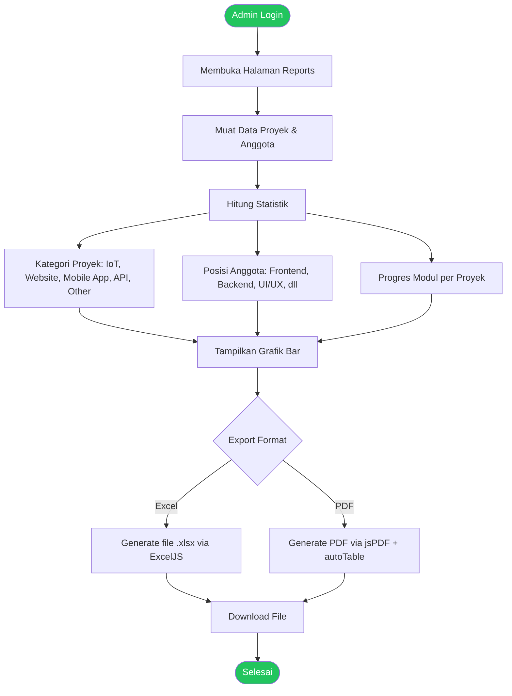

---

## 5. Spesifikasi Program

### 5.1 Struktur Halaman

```
D:\Alvi\test-next\
├── src/
│   ├── pages/
│   │   ├── index.js                    # Landing page
│   │   ├── components/
│   │   │   └── login.js                # Komponen login
│   │   ├── auth/
│   │   │   └── forgot-password.js      # Lupa password (3 langkah)
│   │   ├── dashboardAdmin/
│   │   │   └── admin.js                # Dashboard admin (shell)
│   │   ├── memberDashboard/
│   │   │   └── MemberDashboard.js      # Dashboard member (shell)
│   │   ├── settings/
│   │   │   ├── profile.js              # Edit profil
│   │   │   ├── changepassword.js       # Ganti password
│   │   │   └── settingsTema.js         # Toggle tema
│   │   └── api/
│   │       ├── auth/                   # Autentikasi API
│   │       ├── members/                # Manajemen anggota API
│   │       ├── projects/               # Manajemen proyek API
│   │       ├── revisions/              # Sistem revisi API
│   │       ├── notifications/          # Notifikasi API
│   │       └── stats/                  # Statistik API
│   ├── lib/
│   │   ├── revisionConfig.js           # Konfigurasi role & permission revisi
│   │   ├── notification.js             # Helper notifikasi
│   │   ├── email.js                    # Template email revisi
│   │   └── mailer.js                   # Nodemailer setup & template kredensial
│   ├── generated/
│   │   └── prisma/                     # Prisma client (generated)
│   └── components/
│       ├── componentsDashboard/        # Komponen dashboard (sidebar, cards, dll)
│       └── componentsSettings/         # Komponen settings
├── prisma/
│   ├── auth/schema.prisma              # Schema auth_db
│   ├── project/schema.prisma           # Schema project_db
│   └── monitoring/schema.prisma        # Schema monitoring_db
├── public/
│   └── uploads/                        # File upload (gambar & modul)
├── middleware.js                        # Rate limiting & security headers
├── docker-compose.yml                  # MySQL 8.0 container
└── .env                                # Environment variables
```

### 5.2 API Endpoints

#### Auth API

| Method | Endpoint | Fungsi |
|---|---|---|
| `POST` | `/api/auth/login` | Validasi kredensial, buat JWT cookie |
| `GET` | `/api/auth/me` | Ambil data user dari JWT cookie |
| `GET` | `/api/auth/get-profile` | Ambil profil user (termasuk updatedAt) |
| `PUT` | `/api/auth/update-profile` | Update nama, email, foto profil |
| `POST` | `/api/auth/logout` | Hapus cookie autentikasi |
| `POST` | `/api/auth/forgot-password` | Generate & kirim OTP 6 karakter |
| `POST` | `/api/auth/verify-reset-otp` | Verifikasi OTP (15 menit expiry) |
| `POST` | `/api/auth/reset-password` | Update password + tandai OTP used |

#### Member API

| Method | Endpoint | Fungsi | Akses |
|---|---|---|---|
| `GET` | `/api/members` | Daftar semua anggota | Admin |
| `POST` | `/api/members` | Tambah anggota baru + kirim email kredensial | Admin |
| `DELETE` | `/api/members/[id]` | Hapus anggota | Admin |
| `POST` | `/api/members/resend-email/[id]` | Kirim ulang email kredensial | Admin |

#### Project API

| Method | Endpoint | Fungsi |
|---|---|---|
| `GET` | `/api/projects` | Daftar semua proyek |
| `POST` | `/api/projects` | Buat/update proyek (upsert) |
| `PATCH` | `/api/projects` | Update field proyek (decision, finished, progress) |
| `DELETE` | `/api/projects` | Hapus proyek + lampiran |
| `GET/PATCH/DELETE` | `/api/projects/[id]` | CRUD proyek per ID |
| `POST` | `/api/projects/upload` | Upload proyek dengan file (multipart) |
| `GET` | `/api/projects/download` | Download file lampiran |
| `GET/PATCH/DELETE` | `/api/projects/attachments/[id]` | Kelola lampiran individual |

#### Revision API

| Method | Endpoint | Fungsi |
|---|---|---|
| `GET` | `/api/revisions` | Daftar revisi (dengan filter & paginasi) |
| `POST` | `/api/revisions` | Buat laporan revisi baru |
| `PATCH` | `/api/revisions` | Update status revisi (progress, approval) |
| `DELETE` | `/api/revisions` | Hapus revisi |
| `GET/PATCH/DELETE` | `/api/revisions/[id]` | CRUD revisi per ID |
| `GET/POST` | `/api/revisions/[id]/comments` | Lihat/tambah komentar |

#### Notification API

| Method | Endpoint | Fungsi |
|---|---|---|
| `GET` | `/api/notifications` | Daftar notifikasi (24 jam terakhir) |
| `POST` | `/api/notifications` | Buat notifikasi baru |
| `PATCH` | `/api/notifications` | Tandai sudah dibaca (satu/all) |
| `DELETE` | `/api/notifications` | Hapus notifikasi |
| `DELETE` | `/api/notifications/cleanup` | Hapus notifikasi > 24 jam |
| `GET` | `/api/notifications/count` | Jumlah notifikasi belum dibaca |

### 5.3 Konfigurasi Role Revisi (Sender -> Target)

| Sender Role | Target Role yang Diizinkan |
|---|---|
| QA | Frontend, Backend, PM, UI/UX, DevOps |
| Frontend | Backend, PM, QA |
| Backend | Frontend, PM, QA |
| PM | Frontend, Backend, QA, UI/UX, DevOps |
| UI/UX | Frontend, PM, QA |
| DevOps | Backend, PM |

### 5.4 Tipe Issue Revisi

| Kode | Keterangan |
|---|---|
| `MODUL` | Masalah pada modul/dokumen |
| `PROJECT` | Masalah pada proyek secara umum |
| `INTEGRASI` | Masalah integrasi antar modul |
| `BUG` | Error/bug pada aplikasi |
| `LAINNYA` | Tipe lainnya |

### 5.5 Status Progres Revisi

| Status | Keterangan |
|---|---|
| `BELUM_DILAKUKAN` | Belum ada tindakan |
| `SEDANG_DILAKUKAN` | Sedang dikerjakan |
| `SELESAI` | Pengerjaan selesai |

### 5.6 Status Persetujuan Revisi

| Status | Keterangan |
|---|---|
| `PENDING` | Menunggu keputusan |
| `APPROVED` | Disetujui |
| `REJECTED` | Ditolak |

---

## 6. Arsitektur Sistem

### 6.1 Diagram Arsitektur

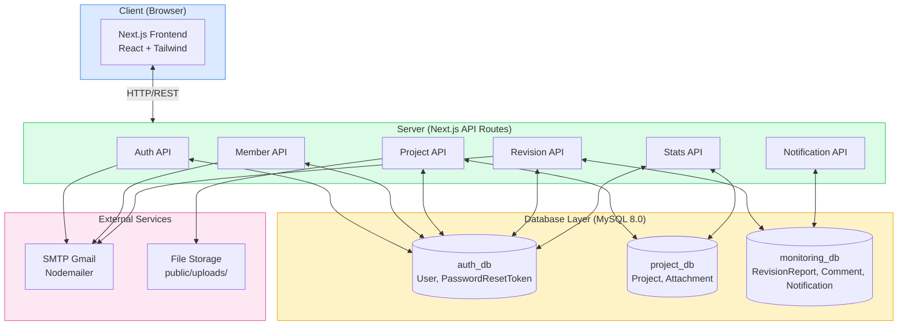

### 6.2 Flow Autentikasi JWT

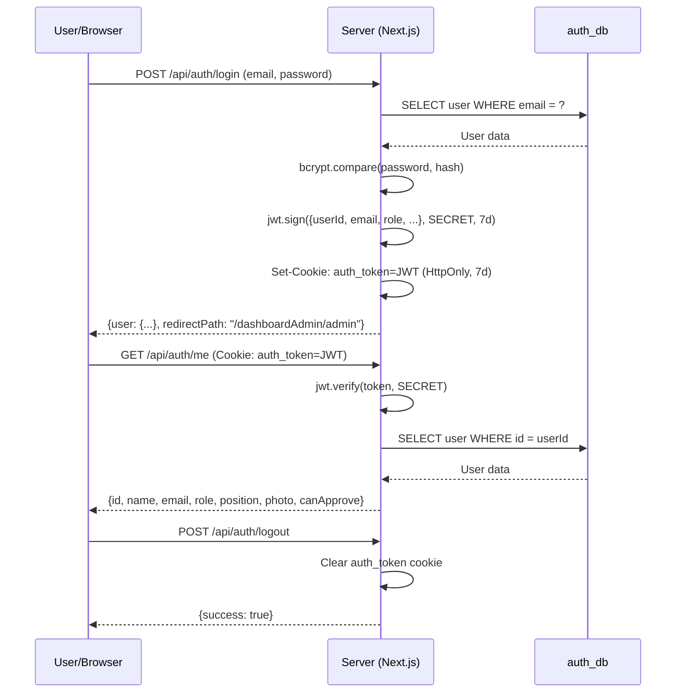

### 6.3 Flow Upload Proyek (Multipart)

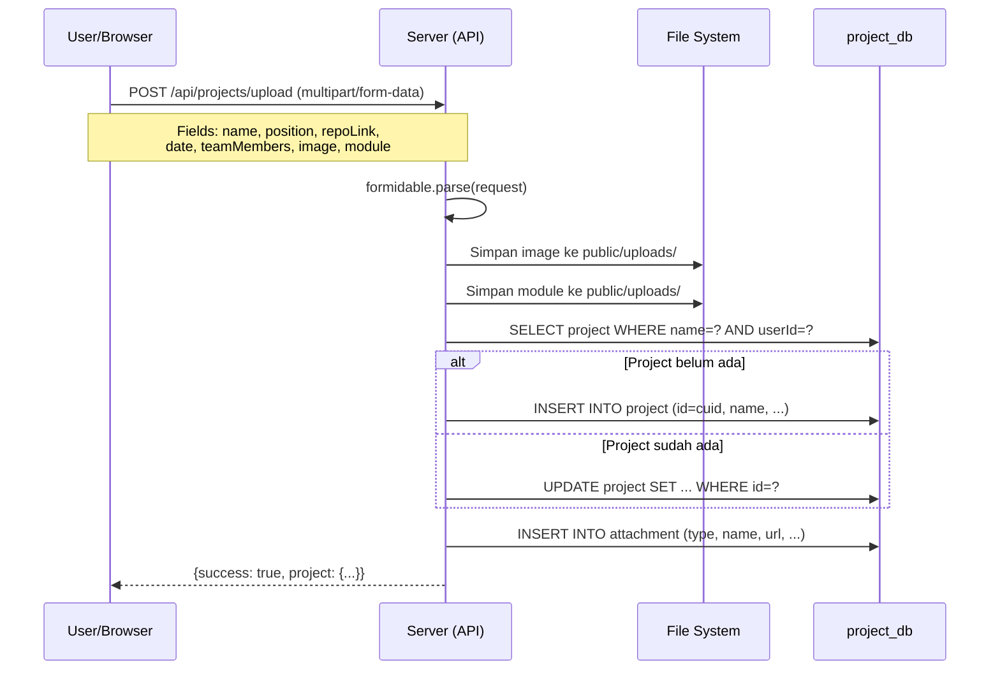

### 6.4 Flow Kirim Revisi + Notifikasi

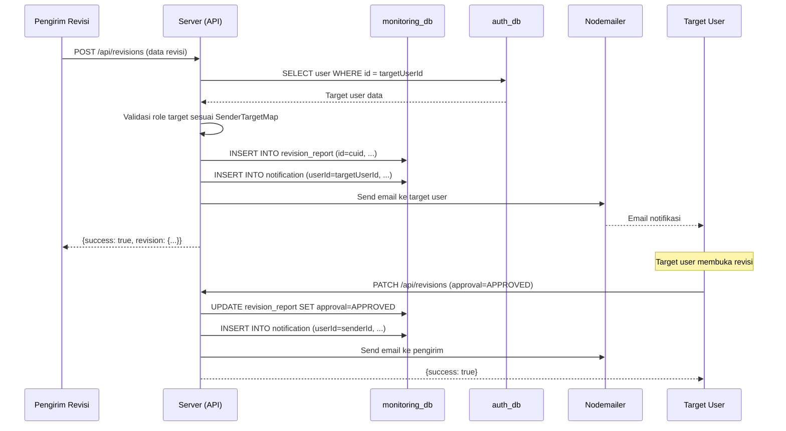

---

## 7. Database (ERD)

### 7.1 Entity Relationship Diagram

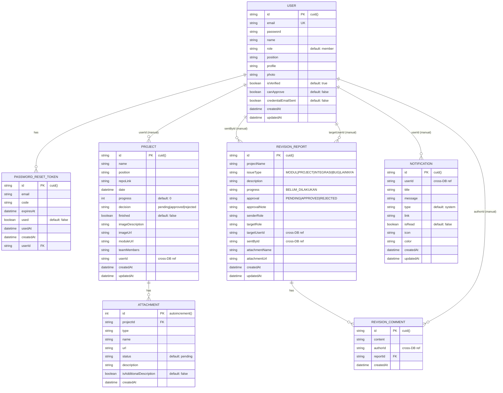

### 7.2 Multi-Database Architecture

```
┌──────────────────────────────────────────────────────────┐
│                    MySQL 8.0 (Docker)                     │
│                                                          │
│  ┌─────────────┐  ┌──────────────┐  ┌─────────────────┐  │
│  │   auth_db   │  │  project_db  │  │  monitoring_db  │  │
│  │             │  │              │  │                 │  │
│  │ • User      │  │ • Project    │  │ • RevisionReport│  │
│  │ • PwdReset  │  │ • Attachment │  │ • RevisionComment│ │
│  │   Token     │  │              │  │ • Notification  │  │
│  └──────┬──────┘  └──────┬───────┘  └────────┬────────┘  │
│         │                │                    │           │
│         └────────────────┼────────────────────┘           │
│                          │                                │
│              Cross-DB refs via String IDs                 │
│              (managed at application layer)               │
└──────────────────────────────────────────────────────────┘
```

---

## Lampiran: Kode Referensi Cepat

### Rate Limiting (middleware.js)
- 20 requests / 15 menit per IP untuk `/api/auth/*`

### Keamanan (Security Headers)
- `X-Frame-Options: DENY`
- `X-Content-Type-Options: nosniff`
- `Content-Security-Policy`
- `Strict-Transport-Security` (production)
- `SameSite=Lax` untuk cookies

### File Upload Limits
- **Foto profil**: max 2MB (jpg, png)
- **Gambar proyek**: max 10MB (jpg, png, gif, webp)
- **Modul proyek**: max 10MB (pdf, doc, docx)

### Auto-Cleanup
- Notifikasi otomatis dihapus setelah **24 jam**
- Token reset password expiring **15 menit**
- JWT cookie expiring **7 hari**
