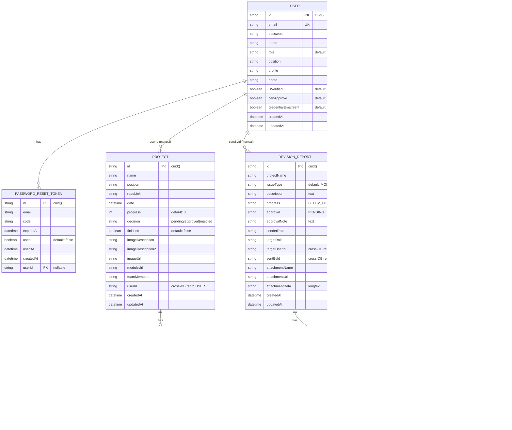
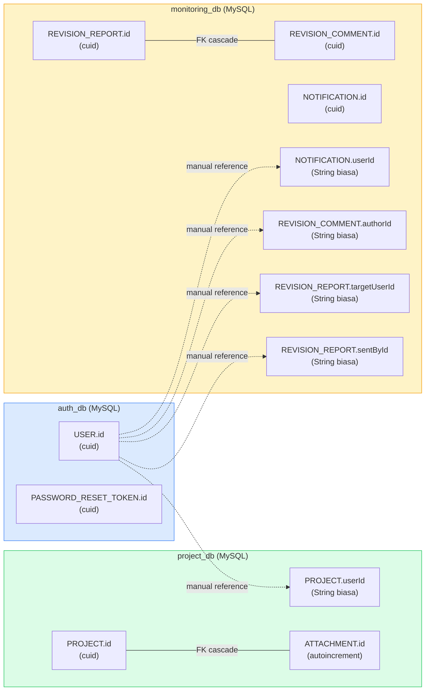

# Usecase: ID System

## Overview

Sistem ID di Linkraweb menggunakan **Prisma `cuid()`** sebagai generator ID utama untuk semua model, kecuali `Attachment` yang menggunakan `autoincrement()` (integer). Arsitektur multi-database mengharuskan referensi antar-database dikelola manual di application layer.

---

## Entity Relationship Diagram (ERD)



---

## Flowchart Sistem

### 1. Autentikasi — Login & Register

```mermaid
flowchart TD
    Start([Start]) --> LoginOrRegister{Akses?}

    LoginOrRegister -->|Login| InputEmail[Input Email + Password]
    LoginOrRegister -->|Register| InputReg[Input Name + Email + Password + Role]

    InputEmail --> ValidateUser{User exists?}
    ValidateUser -->|No| ErrLogin[Error: User tidak ditemukan]
    ValidateUser -->|Yes| CheckPass{Password valid?}
    CheckPass -->|No| ErrPass[Error: Password salah]
    CheckPass -->|Yes| GenToken[Generate LoginToken - 15 min]

    GenToken --> SendMagicLink[Kirim Magic Link via Email]
    SendMagicLink --> UserClick[User klik link dari email]
    UserClick --> VerifyToken{Token valid & unused?}
    VerifyToken -->|No| ErrToken[Error: Token expired/used]
    VerifyToken -->|Yes| MarkUsed[Mark token as used]
    MarkUsed --> GenJWT[Generate JWT - 7 days]
    GenJWT --> SetCookie[Set auth_token HttpOnly Cookie]
    SetCookie --> StoreLocal[Store user data di localStorage]
    StoreLocal --> Redirect{Role?}
    Redirect -->|admin| AdminDash[/dashboardAdmin/admin]
    Redirect -->|member| MemberDash[/memberDashboard/MemberDashboard]

    InputReg --> CreateDB[prismaAuth.user.create - cuid() ID]
    CreateDB --> EmailCred[Kirim email berisi kredensial]
    EmailCred --> Done([Registered])

    ErrLogin --> EndFail([Fail])
    ErrPass --> EndFail
    ErrToken --> EndFail

    style Start fill:#22c55e,color:#fff
    style Done fill:#22c55e,color:#fff
    style EndFail fill:#ef4444,color:#fff
    style AdminDash fill:#3b82f6,color:#fff
    style MemberDash fill:#8b5cf6,color:#fff
```

### 2. Manajemen Project

```mermaid
flowchart TD
    Start([User Login]) --> ViewDash[View Dashboard]
    ViewDash --> Action{Aksi Project}

    Action -->|Buat Baru| FillForm[Isi: Name, Position, RepoLink, dll]
    FillForm --> UploadImg[Upload Image Description]
    UploadImg --> UploadMod[Upload Module File]
    UploadMod --> UpsertDB{Project exists?}

    UpsertDB -->|No| CreateProj[prismaProject.project.create - cuid() ID]
    UpsertDB -->|Ya| UpdateProj[prismaProject.project.update]

    CreateProj --> SaveAttach[Simpan Attachments - autoincrement ID]
    UpdateProj --> SaveAttach

    SaveAttach --> NotifyTeam[Buat Notification ke Team Members]
    NotifyTeam --> Done([Success])

    Action -->|Edit| SelectProj[Pilih Project]
    SelectProj --> EditForm[Edit Fields]
    EditForm --> UpdateDB[prismaProject.project.update]
    UpdateDB --> Done

    Action -->|Hapus| ConfirmDel{Konfirmasi?}
    ConfirmDel -->|Ya| DelProj[prismaProject.project.delete]
    DelProj --> CascadeDel[Attachment otomatis terhapus - Cascade]
    CascadeDel --> Done
    ConfirmDel -->|Tidak| ViewDash

    Action -->|Submit Review| SetPending[decision = pending]
    SetPending --> NotifyPM[Buat Notifikasi ke PM]
    NotifyPM --> Done

    style Start fill:#22c55e,color:#fff
    style Done fill:#22c55e,color:#fff
```

### 3. Sistem Revisi (Role-Based)

```mermaid
flowchart TD
    Start([User kirim Revisi]) --> CheckRole{Sender Role?}

    CheckRole -->|QA| CanSendQA[QA bisa kirim ke: FRONTEND, BACKEND, PM, UIUX, DEVOPS]
    CheckRole -->|FRONTEND| CanSendFE[FRONTEND bisa kirim ke: BACKEND, PM, QA]
    CheckRole -->|BACKEND| CanSendBE[BACKEND bisa kirim ke: FRONTEND, PM, QA]
    CheckRole -->|PM| CanSendPM[PM bisa kirim ke: FRONTEND, BACKEND, QA, UIUX, DEVOPS]
    CheckRole -->|UIUX| CanSendUI[UIUX bisa kirim ke: FRONTEND, PM, QA]
    CheckRole -->|DEVOPS| CanSendDO[DEVOPS bisa kirim ke: BACKEND, PM]

    CanSendQA --> SelectTarget[Pilih Target User]
    CanSendFE --> SelectTarget
    CanSendBE --> SelectTarget
    CanSendPM --> SelectTarget
    CanSendUI --> SelectTarget
    CanSendDO --> SelectTarget

    SelectTarget --> FillRevision[Isi: IssueType, Description, Progress]
    FillRevision --> AttachFile{Ada lampiran?}
    AttachFile -->|Ya| UploadFile[Upload Attachment]
    AttachFile -->|Tidak| SaveReport
    UploadFile --> SaveReport

    SaveReport[Simpan RevisionReport - cuid() ID]
    SaveReport --> CreateNotif[Buat Notification ke Target User]
    CreateNotif --> SendEmail[Kirim Email Notifikasi]
    SendEmail --> Done([Revisi Terkirim])

    Done --> TargetAction{Target User}

    TargetAction -->|Approve| SetApproved[approval = APPROVED]
    TargetAction -->|Reject| SetRejected[approval = REJECTED]
    TargetAction -->|Comment| AddComment[Tambah RevisionComment - cuid() ID]

    SetApproved --> NotifySender1[Buat Notifikasi ke Sender]
    SetRejected --> NotifySender2[Buat Notifikasi ke Sender]
    AddComment --> NotifySender3[Buat Notifikasi ke Sender + Author]

    style Start fill:#22c55e,color:#fff
    style Done fill:#3b82f6,color:#fff
    style SetApproved fill:#22c55e,color:#fff
    style SetRejected fill:#ef4444,color:#fff
```

### 4. Sistem Notifikasi

```mermaid
flowchart TD
    Start([Trigger Event]) --> EventType{Jenis Event}

    EventType -->|Project Dibuat| NotifCreate[Buat Notification: userId = teamMembers]
    EventType -->|Revisi Dikirim| NotifRevision[Buat Notification: userId = targetUserId]
    EventType -->|Revisi Di-approve/reject| NotifResult[Buat Notification: userId = sentById]
    EventType -->|Komentar Ditambah| NotifComment[Buat Notification: userId = revision sender + author]
    EventType -->|Credential Email| NotifCred[Buat Notification: userId = new user]

    NotifCreate --> StoreDB[Simpan ke monitoring_db.Notification - cuid() ID]
    NotifRevision --> StoreDB
    NotifResult --> StoreDB
    NotifComment --> StoreDB
    NotifCred --> StoreDB

    StoreDB --> EmailNotif[Kirim Email via Nodemailer]
    EmailNotif --> BellUpdate[Update Notification Bell di UI]

    BellUpdate --> UserAction{User Action}
    UserAction -->|Klik Bell| ViewNotif[Tampilkan Daftar Notifikasi]
    UserAction -->|Tandai Dibaca| MarkRead[PATCH isRead = true]
    UserAction -->|Navigasi| FollowLink[Buka Link dari Notification]

    ViewNotif --> MarkRead
    MarkRead --> End([Done])
    FollowLink --> End

    Start -->|24 jam berlalu| Cleanup[DELETE notifikasi > 24 jam]
    Cleanup --> End

    style Start fill:#22c55e,color:#fff
    style End fill:#22c55e,color:#fff
    style Cleanup fill:#f59e0b,color:#fff
```

### 5. Alur Data ID Antar Database



---

## Database: `auth_db`

### Model: User

| Field | Type | Generator | Format |
|-------|------|-----------|--------|
| `id` | `String` | `cuid()` | `clxyz1234abc...` (25 char) |

**Use Case:**

- **UC-AUTH-01** — Buat user baru → `cuid()` otomatis di-generate saat `prismaAuth.user.create()`
- **UC-AUTH-02** — Lookup user by ID → Query `prismaAuth.user.findUnique({ where: { id } })`
- **UC-AUTH-03** — Referensi silang dari database lain → Simpan `user.id` sebagai `String` field di `project_db` / `monitoring_db` tanpa foreign key

### Model: PasswordResetToken

| Field | Type | Generator | Format |
|-------|------|-----------|--------|
| `id` | `String` | `cuid()` | `clxyz1234abc...` |

**Use Case:**

- **UC-AUTH-04** — Generate token reset → `cuid()` baru dibuat saat `prismaAuth.passwordResetToken.create()`
- **UC-AUTH-05** — Verifikasi token → `findUnique({ where: { id } })` + cek `used` dan `expiresAt`

---

## Database: `project_db`

### Model: Project

| Field | Type | Generator | Format |
|-------|------|-----------|--------|
| `id` | `String` | `cuid()` | `clxyz1234abc...` |

**Unique Constraint:** `(name, userId)` — composite unique untuk mencegah duplikasi project per user.

**Use Case:**

- **UC-PRJ-01** — Buat project baru → `cuid()` auto-generated; gunakan `findFirst` + `create`/`update` (upsert manual) karena composite unique
- **UC-PRJ-02** — Ambil project by ID → `prismaProject.project.findUnique({ where: { id } })`
- **UC-PRJ-03** — Referensi dari `monitoring_db` → `RevisionReport.projectName` merujuk ke `Project.name`, bukan `Project.id`

### Model: Attachment

| Field | Type | Generator | Format |
|-------|------|-----------|--------|
| `id` | `Int` | `autoincrement()` | `1`, `2`, `3`, ... |

**FK:** `projectId → Project.id` (cascade delete, single-database)

**Use Case:**

- **UC-PRJ-04** — Upload attachment → `id` integer auto-increment, FK langsung ke `Project` (same database)
- **UC-PRJ-05** — Hapus project → Attachment otomatis terhapus via `onDelete: Cascade`

---

## Database: `monitoring_db`

### Model: RevisionReport

| Field | Type | Generator | Format |
|-------|------|-----------|--------|
| `id` | `String` | `cuid()` | `clxyz1234abc...` |

**Cross-DB References (manual):**

| Field | References | Database |
|-------|-----------|----------|
| `sentById` | `User.id` | `auth_db` |
| `targetUserId` | `User.id` | `auth_db` |

**Use Case:**

- **UC-MON-01** — Buat revision report → `cuid()` otomatis; `sentById` dan `targetUserId` disimpan sebagai string biasa
- **UC-MON-02** — Resolve user data → Batch query `prismaAuth.user.findMany({ where: { id: { in: userIds } } })` di API layer
- **UC-MON-03** — Kirim notifikasi → Buat `Notification` dengan `userId` = `targetUserId` dari revision

### Model: RevisionComment

| Field | Type | Generator | Format |
|-------|------|-----------|--------|
| `id` | `String` | `cuid()` | `clxyz1234abc...` |

**FK:** `reportId → RevisionReport.id` (cascade delete, same database)

**Use Case:**

- **UC-MON-04** — Tambah komentar → `cuid()` baru; `authorId` = `User.id` dari `auth_db` (manual reference)
- **UC-MON-05** — Hapus revision → Comment otomatis terhapus via cascade

### Model: Notification

| Field | Type | Generator | Format |
|-------|------|-----------|--------|
| `id` | `String` | `cuid()` | `clxyz1234abc...` |

**No FK** — `userId` merujuk ke `User.id` di `auth_db` secara manual.

**Use Case:**

- **UC-MON-06** — Kirim notifikasi → `cuid()` baru; `userId` disimpan sebagai string
- **UC-MON-07** — Tandai sudah dibaca → `PATCH` field `isRead = true` berdasarkan notif `id`
- **UC-MON-08** — Cleanup notifikasi lama → Hapus notifikasi yang lebih dari 24 jam via `/api/notifications/cleanup`

---

## Cross-Database ID Resolution Pattern

```
┌──────────────┐       String ID (manual)       ┌──────────────┐
│   auth_db    │ ◄────────────────────────────── │ monitoring_db│
│   User.id    │   sentById, targetUserId,       │ RevisionReport│
│   (cuid)     │   authorId, userId (notif)      │ Notification  │
└──────────────┘                                 └──────────────┘
       ▲
       │ String ID (manual)
       │
┌──────────────┐
│  project_db  │
│  Project.id  │
│  (cuid)      │
└──────────────┘
```

**Pattern di API layer:**

```javascript
// 1. Ambil data dari monitoring_db
const reports = await prismaMonitoring.revisionReport.findMany()

// 2. Kumpulkan semua user IDs unik
const userIds = [...new Set([
  ...reports.map(r => r.sentById),
  ...reports.map(r => r.targetUserId)
])]

// 3. Batch resolve dari auth_db
const users = await prismaAuth.user.findMany({
  where: { id: { in: userIds } },
  select: { id: true, name: true, email: true, photo: true }
})

// 4. Map user data ke reports
const userMap = Object.fromEntries(users.map(u => [u.id, u]))
const enriched = reports.map(r => ({
  ...r,
  sender: userMap[r.sentById],
  target: userMap[r.targetUserId]
}))
```

---

## Summary Table

| Model | Database | ID Type | Generator | Cross-DB Refs |
|-------|----------|---------|-----------|---------------|
| User | auth_db | String | cuid() | — |
| PasswordResetToken | auth_db | String | cuid() | — |
| Project | project_db | String | cuid() | userId → User |
| Attachment | project_db | Int | autoincrement() | projectId → Project |
| RevisionReport | monitoring_db | String | cuid() | sentById, targetUserId → User |
| RevisionComment | monitoring_db | String | cuid() | authorId → User |
| Notification | monitoring_db | String | cuid() | userId → User |

---

## Notes

- `cuid()` menghasilkan ID yang **collision-resistant**, **URL-safe**, dan **sortable by time**
- Tidak ada auto-increment di database `auth_db` dan `monitoring_db` untuk menghindari konflik di arsitektur multi-DB
- Referensi antar-database selalu berupa **String plain** — tidak ada Prisma `@relation` lintas database
- User data resolution dilakukan di **application layer**, bukan di database level
